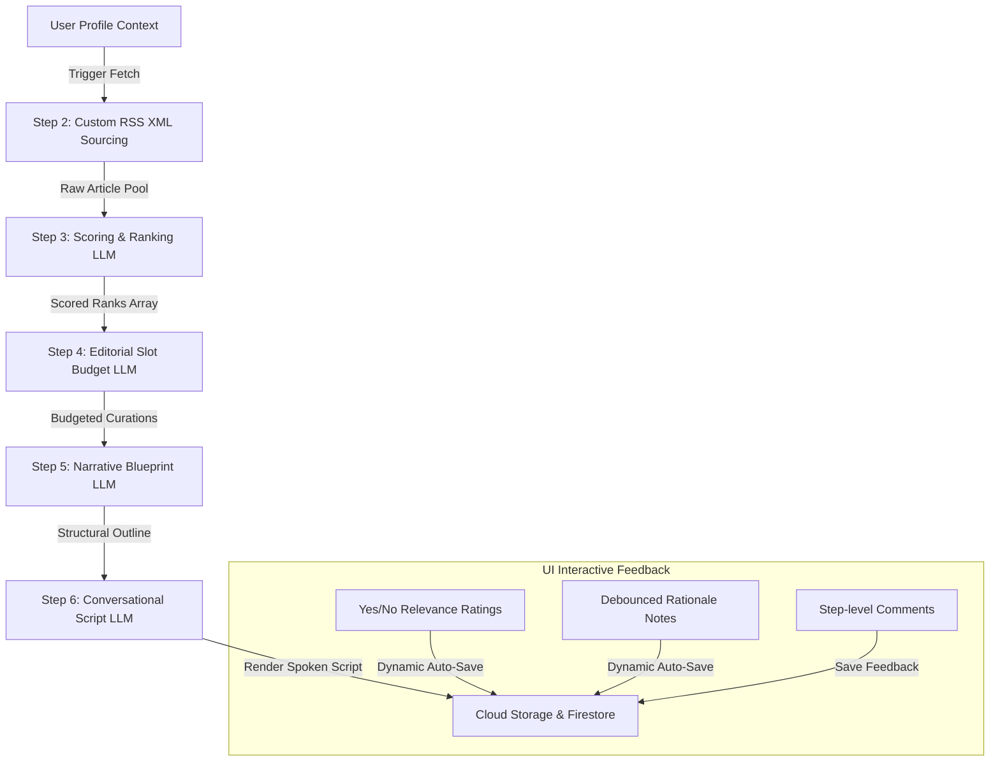
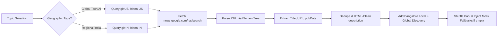

# Specifications — Curia Daily Brief Pipeline Harness

This document outlines the detailed architecture, algorithmic logic, user interface design system, and database structures of the **Curia Daily Brief — Pipeline & Test Harness**.

---

## 🏛️ System Architecture Overview

The Curia Daily Brief Harness is a multi-step, serverless news curation and scriptwriting engine. It pulls global tech and regional headlines, filters them against custom developer context, slots them into editorial categories, and drafts a conversational, ready-to-speak audio transcript.



---

## 🔄 The 6-Step Curation Pipeline

### Step 1: User Profile Configuration
The client captures developer-centric variables in memory to parameterize the LLM system prompts:
1.  **Granular Topics**: Standardized interest topics (e.g., AI & Machine Learning, Semiconductors & Hardware, Startups & Venture Capital, India Tech & Startups).
2.  **User Identity**: Dynamic Username and Location context to personalize greetings and pull regional local news (defaulting to Bangalore).
3.  **Saved Links**: A JSON array of titles and descriptions representing bookmarks recently saved by the user, providing a semantic baseline for content relevance.
4.  **Audio Parameters**: Brief structural layouts (e.g., "Option 1: The Preview" vs. "Option 2: The Lead") and voice tone options (e.g., "Voice A: The Smart Friend" vs. "Voice C: The Curious Companion").

---

### Step 2: Custom High-Performance Sourcing
To avoid rate limits and redirect delays of GNews wrappers, Step 2 utilizes a direct, lightweight XML search parser running in `< 200ms`.



#### Core Sourcing Specifications:
*   **Geographic Localization Bias**: Query topics relating to global technology and semiconductors are forced to use the US geolocation perspective (`gl="US"`, `hl="en-US"`, `ceid="US:en"`) to fetch Silicon Valley breaking updates (e.g. startup fundings, GPU launches). Local topics and general directories use local geo-perspectives (`gl="IN"`, `hl="en-IN"`).
*   **Deduplication & HTML Cleaning**: Dedupes results by URL hashes and title alphanumeric normalization. Descriptions are parsed using regular expressions to strip embedded table markups, tracking links, and anchor tags before serving to the client.
*   **Local & Discovery Buffering**: Automatically appends regional headlines parsed from geo-targeted sections matching the user's city and triggers a randomized global discovery slot (e.g., Space, Health) to break the user's narrative filter bubble.

---

### Step 3: LLM Scoring & Composite Ranking
Raw articles are analyzed against the user profile using a scoring LLM.

#### Scoring Parameters:
| Dimension | Budget | Description |
| :--- | :--- | :--- |
| **Topic Alignment** | `0.0 to 1.0` | How strongly the article aligns with selected active topics. |
| **Recency** | `0.0 to 1.0` | Freshness score (weighting articles from the last 12-24 hours). |
| **Significance** | `0.0 to 1.0` | Mass industry impact (e.g., mega-round funding, major LLM releases). |
| **Save Resonance** | `0.0 to 1.0` | Semantic proximity matching against user-bookmarked links. |

$$\text{Composite Score} = (0.35 \times \text{Alignment}) + (0.15 \times \text{Recency}) + (0.25 \times \text{Significance}) + (0.25 \times \text{Resonance})$$

---

### Step 4: Editorial Curation & Budget Allocation
An LLM functions as an executive editor, filtering the top ranked scoring pool down to strict timing slots:
*   **Lead Story**: The highest-ranking major technological break.
*   **Secondary Slots**: Supporting industry summaries matching active topics.
*   **Local Story**: Regional interest segment localized to the user's hometown.
*   **Discovery Story**: A surprising tangent from the discovery feed to prevent echo-chambers.
*   **Clipped Items**: Stories omitted due to time budgets, saved with explicit editorial rationale.

---

### Step 5: Narrative Outline Blueprint
The outline engine structures the sequence of segments, assigning strict word-count budgets to each block to ensure the final speech falls within a clean 3-5 minute window:

```json
{
  "segments": [
    { "type": "Intro", "content_plan": "Friendly greeting to user and quick high-level tease.", "word_budget": 50 },
    { "type": "Lead Story", "content_plan": "In-depth analysis of the massive funding raise or model launch.", "word_budget": 120 },
    { "type": "Industry Glimpse", "content_plan": "Fast, high-level summaries of supporting tech items.", "word_budget": 100 },
    { "type": "Hometown Update", "content_plan": "Local community updates matching home location.", "word_budget": 60 },
    { "type": "Discovery Tangent", "content_plan": "Fascinating space or scientific breakthrough.", "word_budget": 60 },
    { "type": "Outro", "content_plan": "Dynamic sign-off and tease of next brief content.", "word_budget": 40 }
  ]
}
```

---

### Step 6: Conversational Scriptwriting
Generates spoken transcript prose that flows naturally when read aloud:
*   **Dynamic Greetings**: Automatically injects `{username}` and home `{location}` in the first introductory block.
*   **Speech Markers**: Eliminates nested brackets, code snippets, or bullet-lists, translating all text into fluid conversational voiceovers.
*   **Audio Length**: Matches target speed calculations at a default of `150 words per minute` (WPM).

---

## 🎨 Minimalist Developer UI (PostHog Cream Theme)

The test harness interface is built upon a developer-centric, warm minimalist style using a light color palette, robust spacing, and fluid CSS transitions.

```
+---------------------------------------------------------------------------------+
|  CURIA // Daily Brief Pipeline Harness                      [Settings] [Online] |
+------------------------------------+--------------------------------------------+
|  USER CONFIGURATION (LEFT)         |  PIPELINE WORKSPACE (CENTER)               |
|                                    |                                            |
|  Active Interest Topics            |  Step 2: Sourcing Google News & Local RSS  |
|  [ AI & ML ] [ Semiconductors ]    |  ========================================  |
|                                    |  ( Article Card: Title Link + Arrow CTA )  |
|  User Name: [ Aditya           ]   |  - Title: Anthropic raises $65B ... [↗]    |
|                                    |  - Meta: Source: Bloomberg | Date: Today   |
|  Location:  [ Bangalore        ]   |  - Relevance? [ Yes ] [ No ]               |
|                                    |  - Why?: [ Why relevant? (debounced)   ]   |
|  [ Radio: Structure ]              |                                            |
|  [ Radio: Voice Tone ]             |  Step 3: Personal Scoring & Ranking (LLM)  |
|                                    |  ========================================  |
|  [ Run End-to-End Pipeline ]       |  Step 4: Editorial Slot Budget Allocation  |
+------------------------------------+--------------------------------------------+
```

### Key UI Features:
1.  **Vertical Timeline Connector**: Cards are separated by a spacious `1.75rem` gap and linked together by a thin left-border vertical line that flows down the page.
2.  **Status Bullet Micro-animations**: Status indicators blink and change colors dynamically to guide developers through active execution:
    *   `Idle` ➡️ Solid Neutral Gray
    *   `Running` ➡️ Blinking Pulse Yellow
    *   `Success` ➡️ Vibrant HSL Active Green
    *   `Error` ➡️ Vibrant HSL Rose Red
3.  **Premium Article Cards**:
    *   **Title Anchor Links**: Wrapping titles in clickable `.pool-item-link` text that underlines and focuses on hover.
    *   **Redirect CTA**: An external link redirect button (`.pool-item-arrow`) containing a Lucide `arrow-up-right` icon. Highlights to deep active cyan (`var(--accent-cyan)`) with a clean background glow on hover, redirecting to the publisher's origin page in a new browser tab.

---

## 🗄️ Database & API Schema

Curia leverages **Google Cloud Firestore** in production for structured logging and local fallback file serialization (`app/data/runs/run_*.json`) in local environments.

### Cloud runs Collection Document Schema:
```json
{
  "filename": "run_1716912345000.json",
  "timestamp": "2026-05-30 13:37:00",
  "user_profile": {
    "name": "Aditya",
    "location": "Bangalore",
    "interests": ["AI & Machine Learning", "Semiconductors & Hardware"],
    "saves": [
      {
        "title": "Stateful tools in AI",
        "url": "https://example.com/stateful-tools",
        "summary": "Semantic reference outline..."
      }
    ],
    "days_since_last_brief": 2,
    "structure": "Structure 1",
    "voice": "Voice A"
  },
  "pipeline_steps": {
    "step_2_raw_articles": [ ... ],
    "step_3_scored_articles": [ ... ],
    "step_4_curated_slots": [ ... ],
    "step_5_narrative_outline": [ ... ],
    "step_6_transcript": {
      "latency_ms": 1850,
      "text": "Spoken prose block...",
      "parsed_segments": [ ... ]
    }
  },
  "feedback": {
    "3": { "rating": "up", "comment": "Excellent technical accuracy on Nvidia chips." },
    "4": { "rating": null, "comment": "" }
  },
  "article_feedbacks": {
    "https://example.com/art1": {
      "title": "Anthropic raises $6.5 Billion",
      "relevant": true,
      "reason": "Crucial update for startup AI valuations."
    }
  }
}
```

---

## 🔌 API Routing Contract

### `GET /api/status`
Checks health of the harness, model configuration, and Anthropic API keys.

### `POST /api/news/fetch`
Fetches news pool in Step 2.
*   **Request**: `UserProfile` JSON payload.
*   **Response**: `{ "status": "success", "articles_count": 70, "articles": [...] }`

### `POST /api/runs/feedback`
Updates thumbs-ratings and textual comments for specific pipeline step IDs.
*   **Request**: `FeedbackRequest` JSON payload.

### `POST /api/runs/article-feedback` (Immediate Auto-Save)
Updates individual article relevance rating tag or comments dynamically inside a run.
*   **Request**: `{ "filename": "...", "url": "...", "title": "...", "relevant": true/false/null, "reason": "..." }`
*   **Auto-save Mechanism**: The client debounces user typing by **400ms** to compress Firestore write frequencies, immediately saving Yes/No status updates in the background.
